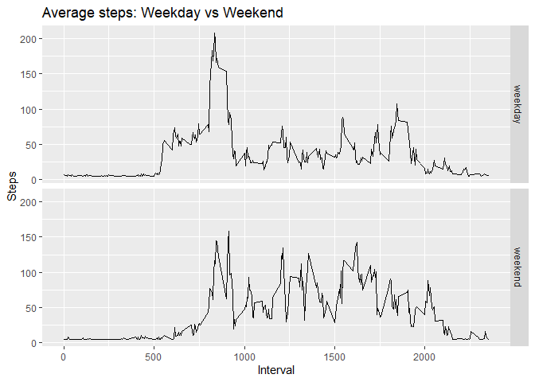

## Loading and preprocessing the data

```r
library(dplyr) 
```

```
## 
## Attaching package: 'dplyr'
```

```
## The following objects are masked from 'package:stats':
## 
##     filter, lag
```

```
## The following objects are masked from 'package:base':
## 
##     intersect, setdiff, setequal, union
```

```r
library(ggplot2)
unzip(zipfile = "activity.zip") 
activity <- read.csv("activity.csv")
activity$date <- as.Date(activity$date)
```

## What is mean total number of steps taken per day?

```r
daily_steps <- activity %>% group_by(date) %>%
    summarise(steps_per_day = sum(steps)) %>% na.omit()
```

```
## `summarise()` ungrouping output (override with `.groups` argument)
```
1. Histogram: Total number of steps taken each day 

```r
hist(daily_steps$steps_per_day, main= "Histogram of Daily Steps", xlab = "Daily Steps", breaks = 20)
```

<!-- -->

2. **Mean** and **median** total number of steps taken per day

```r
meansteps <- mean(daily_steps$steps_per_day)
```
The mean is 1.0766189\times 10^{4}

```r
mediansteps <- median(daily_steps$steps_per_day)
```
The median is 10765

## What is the average daily activity pattern?
1. Average steps in 5-minute interval    

```r
steps_interval <- activity %>%
        group_by(interval) %>%
        summarize(intervalsteps = mean(steps, na.rm = TRUE)) 
```

```
## `summarise()` ungrouping output (override with `.groups` argument)
```

```r
plot(steps_interval$interval, steps_interval$intervalsteps, type = "l", xlab = "5-minute Interval", ylab = "Average steps", main = "Average steps by 5-minute intervals")
```

<!-- -->

2. Maximum average steps in a 5-minute interval

```r
maxsteps <- max(steps_interval$intervalsteps)
```
The maximum average steps in a 5-minute interval are 206.1698113

## Imputing missing values
1. Finding the number of observations with missing values 

```r
missingvalues <- sum(is.na(activity$steps))
```
There are 2304 in the data set. 

2. Create main dataset imputing mean to NA 

```r
activity1 <- activity
activity1$steps[is.na(activity1$steps)] <- mean(activity1$steps, na.rm=TRUE)
```
3. Total number of steps on each day after NA = mean

```r
daily_steps1 <- activity1 %>% group_by(date) %>%
    summarise(steps_per_day = sum(steps))
```

```
## `summarise()` ungrouping output (override with `.groups` argument)
```
1. Histogram: Total number of steps taken each day after imputing 

```r
hist(daily_steps1$steps_per_day, main= "Histogram of Daily Steps", xlab = "Daily Steps", breaks = 20)
```

<!-- -->

2. **Mean** and **median** total number of steps taken per day after imputing

```r
meansteps1 <- mean(daily_steps1$steps_per_day)
```
The mean is 1.0766189\times 10^{4}

```r
mediansteps1 <- median(daily_steps1$steps_per_day)
```
The median is 1.0766189\times 10^{4}


```r
mean_difference <- meansteps1 - meansteps
```
The mean of both imputed and non-imputed data is the same. 

```r
median_difference <- mediansteps1 - mediansteps
```
The imputed median is higher by 1.1886792 compared to the non-imputed mean.   

The total daily number of steps in the second data set (after imputing mean at NA) is higher than in the first data set.  

## Are there differences in activity patterns between weekdays and weekends?

```r
activitybyday <- activity1 
activitybyday$day <- ifelse(weekdays(activitybyday$date) %in% c("Saturday", "Sunday"), "weekend", "weekday")
activityweekday <- filter(activitybyday, activitybyday$day == "weekday")
activityweekend <- filter(activitybyday, activitybyday$day == "weekend")  

activityweekday <- activityweekday %>% group_by(interval) %>% summarise(steps = mean(steps))
```

```
## `summarise()` ungrouping output (override with `.groups` argument)
```

```r
activityweekday$day <- "weekday"
activityweekend <- activityweekend %>% group_by(interval) %>% summarise(steps = mean(steps))
```

```
## `summarise()` ungrouping output (override with `.groups` argument)
```

```r
activityweekend$day <- "weekend"
Combined <- rbind(activityweekday, activityweekend)
Combined$day <- as.factor(Combined$day)

g<- ggplot(Combined, aes(interval, steps))
g+  geom_line() + 
    facet_grid(day~.) + labs(x= "Interval") + labs(y= "Steps") + ggtitle("Average steps: Weekday vs Weekend")
```

<!-- -->

Weekday activity spikes higher than weekend activity in the mornings, while weekend activity in afternoon is higher than during weekdays. 

  


